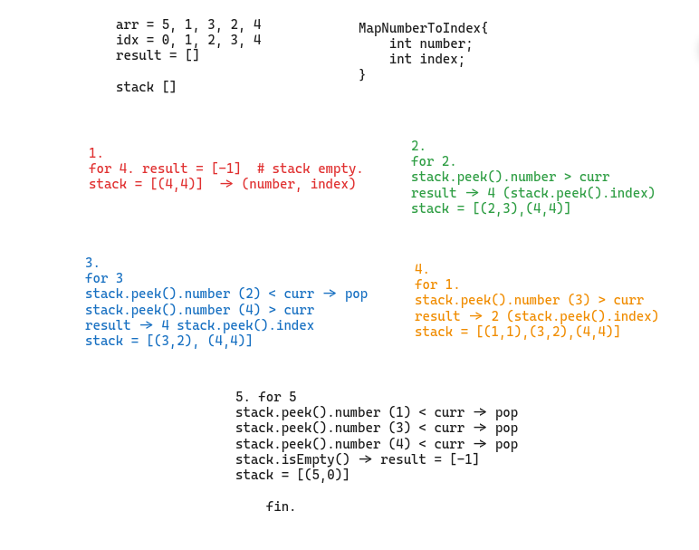

```
import java.util.*;

public class NearestGreatest{

    class MapNumberToIndex{
        int number;
        int index;
        
        MapNumberToIndex(int number, int index){
            this.number = number;
            this.index = index;
        }
        
    }
    
    public int[] findNearestGreatestToRight(int[] arr){
    
        int[] result = new int[arr.length];
        int n = arr.length;
        Stack<MapNumberToIndex> stack = new Stack<>();
        
        // 5 1 3 2 4

        
        for(int i=n-1;i>=0;i--){
            int curr = arr[i];
            
            //for nearest smallest to left, just altering the below comparison will do.
            while(!stack.isEmpty() && stack.peek().number < curr){
                stack.pop();
            }
            
            if(stack.isEmpty()){
                result[i] = -1;
            }
            else{
                result[i] = stack.peek().index;
            }
            stack.push(new MapNumberToIndex(arr[i], i));
        }
        
        return result;
    }
    
    public static void main(String[] args){
        
        NearestGreatest ng = new NearestGreatest();
        int[] arr = {5,1,3,2,4};
        int[] res = ng.findNearestGreatestToRight(arr);
        Comparator<Integer> comp = (c1, c2) -> Integer.compare(c1, c2);
        for(int i: res){
            System.out.print(i+" ");
        }
   }
        
}
```


